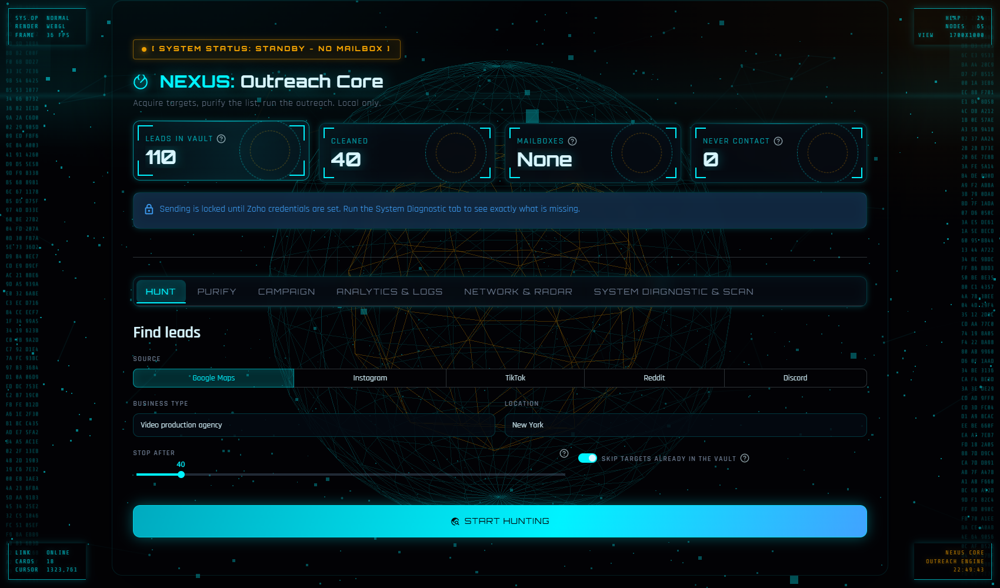
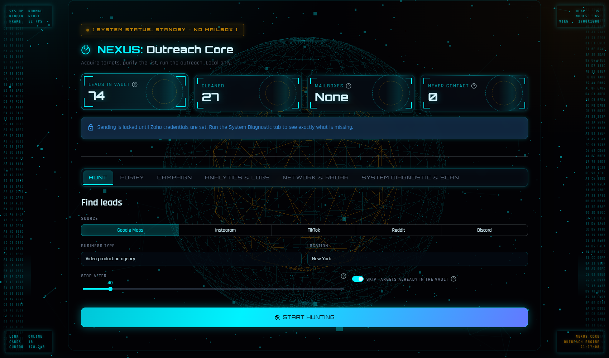

# NEXUS: Outreach Core

A local-first B2B lead engine. It finds businesses and creators across five
public sources, cleans the list down to deliverable addresses, and runs cold
email campaigns at a human cadence across rotating mailboxes — behind a
WebGL command-centre interface built on Streamlit.

Everything runs on your machine. No SaaS, no account, no data leaving the box
except the requests you explicitly trigger.



---

## What it does

**Hunt** — Scrapes five sources through one interface:

| Source | Finds | Returns |
| --- | --- | --- |
| Google Maps | Local businesses by keyword and city | Name, site, phone, category, email |
| Instagram | Accounts and hashtags | Handle, bio, external link, email |
| TikTok | Accounts and hashtags | Handle, bio, bio link, email |
| Reddit | Communities by niche | Subreddit, size, description |
| Discord | Public servers by keyword | Server, tags, public listing link |

Maps and social leads are enriched by visiting the business site and its
contact pages, so a listing without a visible address still resolves to one.
Reddit and Discord return communities rather than people — they land in the
vault as intelligence, not as emailable contacts.

**Purify** — Deduplicates, validates syntax, strips role inboxes
(`info@`, `sales@`, `support@`, ~50 more), and drops the false positives that
naive scrapers keep: image filenames like `logo@2x.png`, CDN and analytics
domains, `(at)` / `(dot)` obfuscation.

**Campaign** — Sends through rotating Zoho mailboxes, round-robin, with the
From header and Message-ID following the active sender. Randomised 2–6 minute
gaps, periodic longer breaks, a hard daily cap, and A/B template testing with
spintax. The blacklist gate runs before a message is built, so a blocked
address never reaches an SMTP connection.

**Analyse** — Live metrics, delivery timeline, A/B comparison, a 3D geographic
radar of where the leads are, and a force-directed graph wiring every target to
its type and city.



---

## Install

Requires Python 3.10 or newer on Windows, macOS or Linux.

```bash
git clone https://github.com/jryahia/nexus-outreach-core.git
cd nexus-outreach-core

python -m venv .venv
.venv\Scripts\python.exe -m pip install -r requirements.txt   # Windows
# source .venv/bin/activate && pip install -r requirements.txt  # macOS / Linux

.venv\Scripts\scrapling.exe install                            # browser binaries
```

Copy the example config and fill it in:

```bash
cp .env.example .env
```

At minimum set `ZOHO_ACCOUNTS` (or `ZOHO_EMAIL` + `ZOHO_APP_PASSWORD`) to send.
Scraping works without any credentials. Use an app-specific password, never
your account password.

## Run

```
start.bat
```

Or directly:

```bash
.venv\Scripts\python.exe -m streamlit run app.py
```

The console opens on `http://localhost:8501`. The **System Diagnostic** tab
reports exactly what is configured and what is missing — run it first.

---

## Architecture

```
app.py              Streamlit UI: six tabs, fragment-based live polling
core/
  hunter.py         Five scrapers, dedup gate, site email discovery
  purifier.py       Lead schema, validation, classification, phone parsing
  cannon.py         SMTP sending, mailbox rotation, spintax, A/B assignment
  vault.py          SQLite storage, WAL, dedup keys, blacklist, migrations
  diagnostics.py    29-point health scan of config, engine and storage
  geo.py            Offline geocoder and deck.gl map construction
  network.py        Force-directed graph model
  config.py         Environment parsing and validation
ui/
  state.py          Thread-safe job handles for background work
  theme.py          Stylesheet and the WebGL/HUD runtime
tools/
  selftest.py       227 offline checks
```

**Threading.** Scrapes and campaigns run on daemon threads so the interface
never blocks and STOP is always clickable. Workers never touch Streamlit APIs;
they report into a lock-guarded structure the UI polls. Waiting uses
`Event.wait`, not `sleep`, so STOP lands mid-gap instead of minutes late —
measured at 0.000s.

**Storage.** SQLite in WAL mode, one short-lived connection per operation.
Nothing is cached across threads, which is what lets the campaign worker write
while the analytics view reads. Verified under 400 writes against 391
concurrent read cycles with zero lock errors.

**Interface.** The background is a Three.js core rendered behind a transparent
app shell; the node constellation, cursor spotlight and targeting rings are
composited layers above it. Every animation runs on `transform` or `opacity`
so it composites off the main thread, and the whole motion layer is disabled
under `prefers-reduced-motion`. Measured at a 10.1 ms median frame.

---

## Testing

```bash
.venv\Scripts\python.exe tools\selftest.py
```

227 checks, fully offline — spintax, mailbox rotation, A/B assignment, the
blacklist gate, dedup key scoping, WAL behaviour, migrations, geocoding, graph
construction, job dispatch, and a dry-run campaign stopped mid-delay to prove
cancellation. Exit code is non-zero if anything fails.

`tools/livetest.py` exercises the live scrapers against the network.
`tools/tiktok_login.py` stores a browser profile for TikTok, which blocks
logged-out requests.

---

## Responsible use

This sends unsolicited commercial email, which is regulated. Before running a
campaign:

- Keep `UNSUBSCRIBE_LINE` and `POSTAL_ADDRESS` populated. CAN-SPAM requires a
  working opt-out and a physical address; GDPR requires a lawful basis for
  contacting EU recipients.
- Honour every opt-out. The blacklist is permanent and is checked before a
  message is built.
- Respect each platform's terms of service. The scrapers read public pages only
  and never bypass authentication.
- Keep the sending cadence human. The defaults exist for that reason.

You are responsible for how you use this.

## License

MIT — see [LICENSE](LICENSE).
